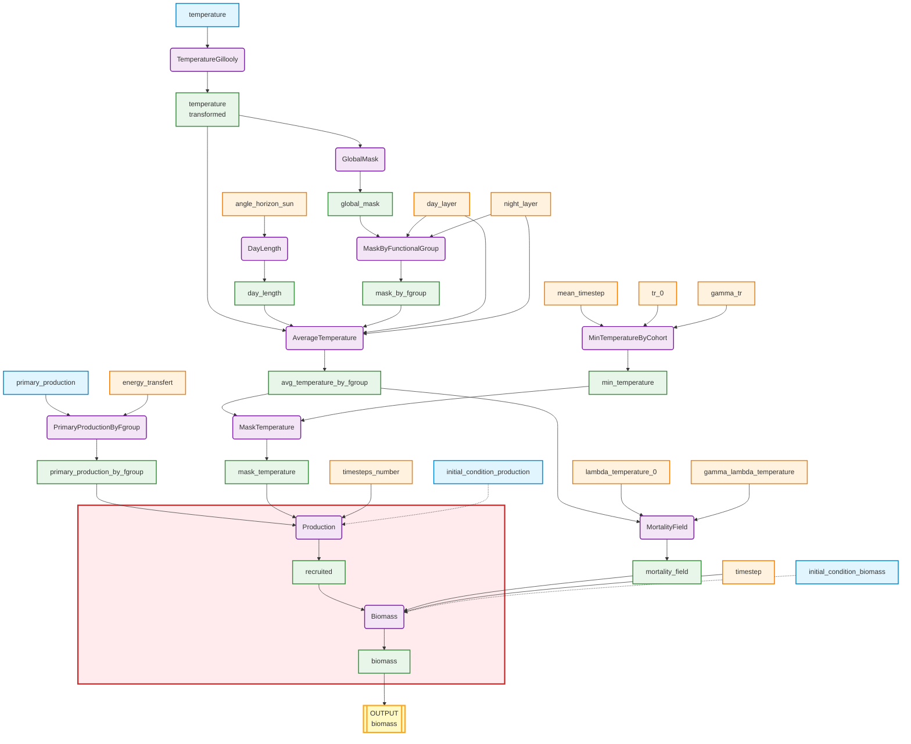

# NoTransportModel - Flowchart

Ce diagramme représente le flux de données et de calcul du modèle NoTransportModel avec le kernel NoTransportKernel.

## Légende

### Éléments du diagramme

- **Forcings (bleu clair)** : Données d'entrée du modèle
  - `temperature` : Température par couche
  - `primary_production` : Production primaire
  - `initial_condition_production` : Conditions initiales de production (optionnel)
  - `initial_condition_biomass` : Conditions initiales de biomasse (optionnel)

- **Parameters (orange)** : Paramètres de configuration du modèle
  - Functional Group: `energy_transfert`, `lambda_temperature_0`, `gamma_lambda_temperature`, `tr_0`, `gamma_tr`, `day_layer`, `night_layer`, `timesteps_number`, `mean_timestep`
  - Kernel: `angle_horizon_sun`
  - Forcing: `timestep`

- **Kernel Units (violet)** : Fonctions de transformation sans gestion interne du temps
  - Transformation, masques, calculs de champs intermédiaires

- **Numba Kernels (rouge - subgraph)** : Fonctions avec JIT compilation et boucle FOR interne sur les pas de temps
  - `ProductionKernel` : Calcul du recrutement avec gestion des cohortes (expand_dims, ageing, production)
  - `BiomassKernel` : Intégration de la biomasse (biomass_euler_implicite)

- **States (vert)** : États intermédiaires produits par les kernels
  - Produits par chaque kernel et utilisés comme entrées par les suivants

- **Output (jaune)** : Résultat final du modèle
  - `biomass` : Biomasse finale par groupe fonctionnel

### Notes importantes

1. **Gestion du temps** : Les deux kernels dans le subgraph rouge (ProductionKernel et BiomassKernel) utilisent Numba pour la compilation JIT et contiennent des boucles FOR explicites sur les pas de temps.

2. **Conditions initiales optionnelles** : Les liens en pointillés (-.-> ) représentent les conditions initiales optionnelles qui ne sont utilisées que si elles sont fournies dans la configuration.

3. **Ordre d'exécution** : Le flux se lit de gauche à droite. Chaque kernel attend que tous ses inputs (forcings, parameters, states) soient disponibles avant de s'exécuter.

4. **Dépendances** : Les flèches montrent clairement les dépendances entre les différentes étapes du calcul.
